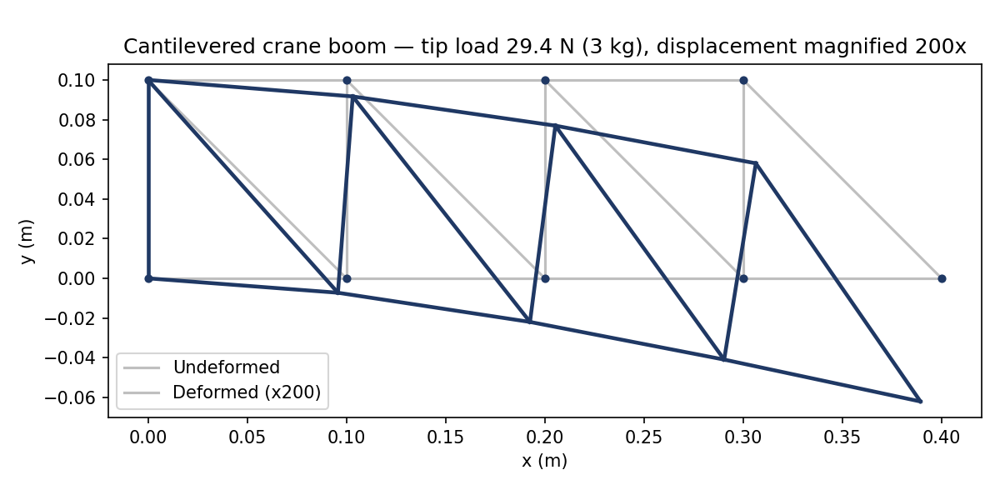
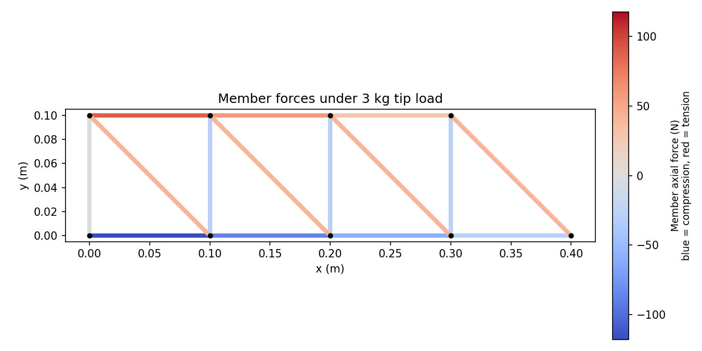

# Truss Structural Analysis Solver

A from-scratch Python implementation of the **Direct Stiffness Method** (the matrix formulation underlying finite element analysis) for 2D pin-jointed trusses — built to generalise the truss-analysis approach I used in my **Table-Top Crane** project (hand-calculated truss geometry, built and load-tested physically) into a reusable, tested computational tool.

Given a truss's node geometry, member properties, supports and applied loads, the solver computes:

- nodal displacements
- support reactions
- axial force in every member (tension positive, compression negative)
- axial stress and factor of safety against a chosen allowable stress

Unlike the method of joints/sections (which requires a statically determinate structure to solve by hand), the stiffness method assembles a global stiffness matrix and solves compatibility and equilibrium simultaneously — so it handles **statically indeterminate** trusses as well, which is the same underlying method used by commercial FEA packages like Ansys, just at a much smaller scale.

## Why this exists

My Table-Top Crane project involved designing a truss-based crane boom by hand using formal truss-analysis methods, then validating the final design with FEA in Ansys. This project takes that same underlying method and turns it into general-purpose, reusable code — rather than a one-off calculation for a single geometry — and demonstrates it against a representative crane-boom-style truss.

## Verification

Before trusting the solver on a new geometry, I validated it against a classic statically-determinate 3-bar "A-frame" truss with a known method-of-joints solution:

```
AB (tension):        500.00 N   (expected +500.00 N)
AC (compression):   -707.11 N   (expected -707.11 N)
BC (compression):   -707.11 N   (expected -707.11 N)
Reaction at A (Fy):   500.00 N   (expected +500.00 N)
Reaction at B (Fy):   500.00 N   (expected +500.00 N)
```

Run it yourself:

```bash
python tests/test_solver.py
```

## Worked example: cantilevered crane boom

`crane_boom_example.py` builds a representative 4-bay cantilevered Pratt truss (400 mm reach, 100 mm depth, wall-mounted base) — the same general boom configuration as the physical Table-Top Crane build — and applies a tip load representing the crane's 3 kg maximum design lift (the worst case of its 1–3 kg target range).

```bash
python crane_boom_example.py
```

This prints the axial force, stress and factor of safety for every member, and produces two plots:

**Deformed shape** (displacement magnified 200x for visibility):



**Member forces** (colour-mapped tension/compression):



Bottom chord is in compression, top chord in tension, and both increase moving from the tip towards the fixed base — exactly the load path you'd expect from a cantilevered truss, and a useful sanity check that the model behaves physically before trusting its numbers.

Material properties (E = 11 GPa, 8 mm dowel diameter, 15 MPa allowable stress) are representative assumptions for a timber dowel, stated explicitly in the code — this is a demonstration of the method on a boom-like geometry, not a digital twin of the physical build's measured properties.

## Project structure

```
truss_solver.py          # Core solver: TrussModel, direct stiffness assembly, solve()
crane_boom_example.py    # Worked example: cantilevered boom + plots
tests/test_solver.py     # Validation against a hand-calculated result
plots/                   # Generated output plots
requirements.txt
```

## Usage

```python
from truss_solver import TrussModel

model = TrussModel()
a = model.add_node(0.0, 0.0)
b = model.add_node(4.0, 0.0)
c = model.add_node(2.0, 2.0)

model.add_element(a, c, E=200e9, A=0.0005)  # steel, 500 mm^2
model.add_element(b, c, E=200e9, A=0.0005)
model.add_element(a, b, E=200e9, A=0.0005)

model.fix(a, x=True, y=True)   # pin support
model.fix(b, x=False, y=True)  # roller support

model.add_load(c, fx=0.0, fy=-1000.0)  # 1000 N downward

result = model.solve()
print(result.summary(allowable_stress=250e6))
```

## Requirements

```bash
pip install -r requirements.txt
```

`numpy`, `matplotlib`

## Possible extensions

- Buckling check on compression members (Euler critical load), since long slender members can fail well below their material's compressive strength
- Support for temperature loads / prescribed support settlement
- 3D (space truss) generalisation

---

Mahbubur Rashid · [github.com/mrashid1232](https://github.com/mrashid1232)
